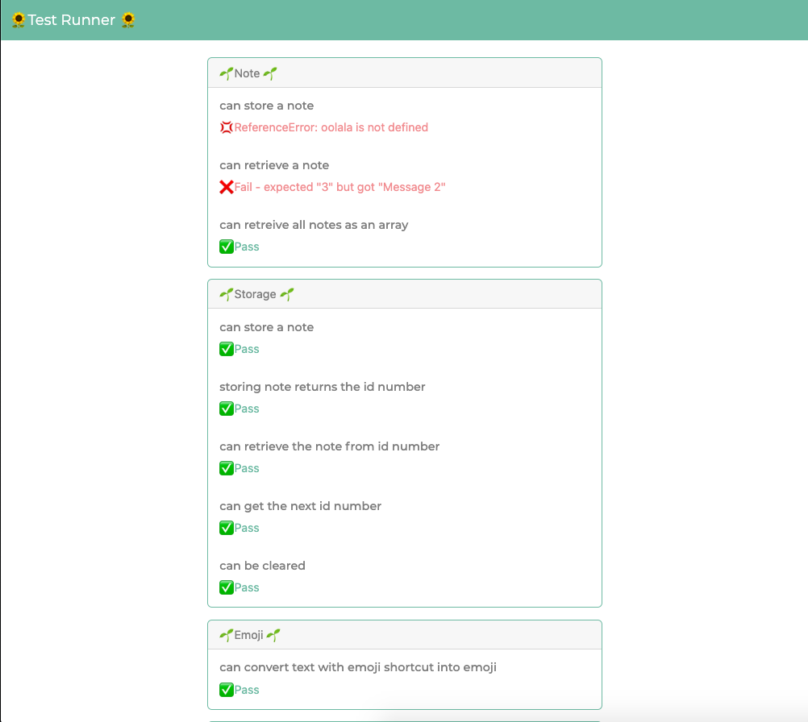

# notes-app

## Specification

Create a front end, single page, note taking app using only vanilla JavaScript.

Mock Up


<details>
  <summary>User Stories</summary>

```
As a programmer
I can see a list of my notes, where each note is abbreviated to the first 20 characters
So I can find the one I want
```

```
As a programmer
I can create a new note
So I can record something I need to remember
```

```
As a programmer
I can see the full text of an individual note on its own page
So I can see all the information in the note
```

```
As a programmer
I can use shortcodes like `:fire:` that get converted into emojis like 🔥
So I can record notes with fun little pictures
```

Additional user story:
```
As a programmer
I can refresh the page and still see my notes
So I can remember what I took down
```
</details>

## Team Members
* <a href="https://github.com/camilla000">Camilla</a>
* <a href="https://github.com/frank-mck">Frank</a>
* <a href="https://github.com/YinnyF">Cynthia</a>

## Diagram


(Draft)

## Domain Model
(Pending)

## How to Run
To Run App: open `index.html` with Live Server.

To Run Tests: open `TestRunner.html` with Live Server.

## Development process
### Testing Interface


⬇️


⬇️


⬇️

✨ Results ✨



### Notes App Interface
TBC